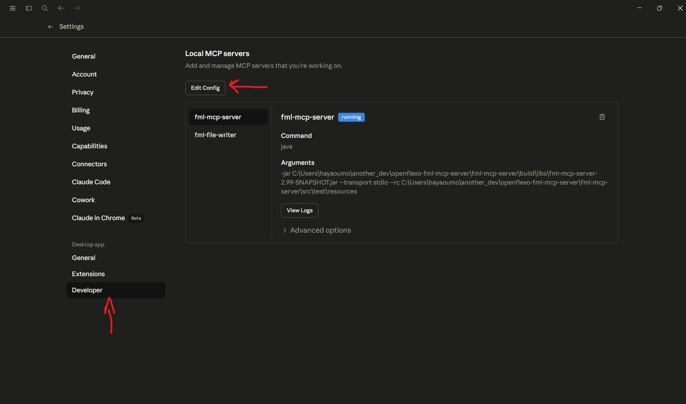
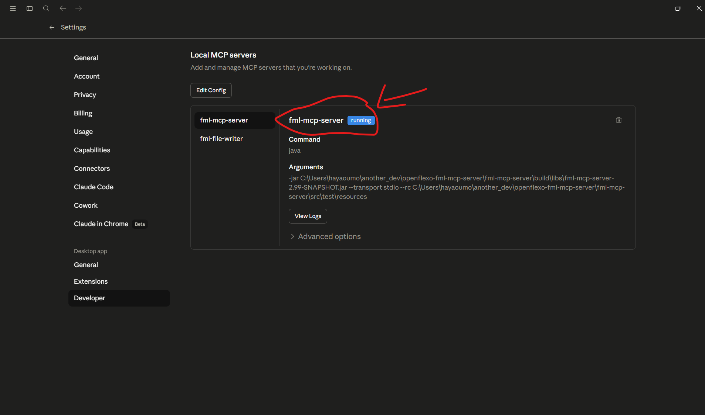
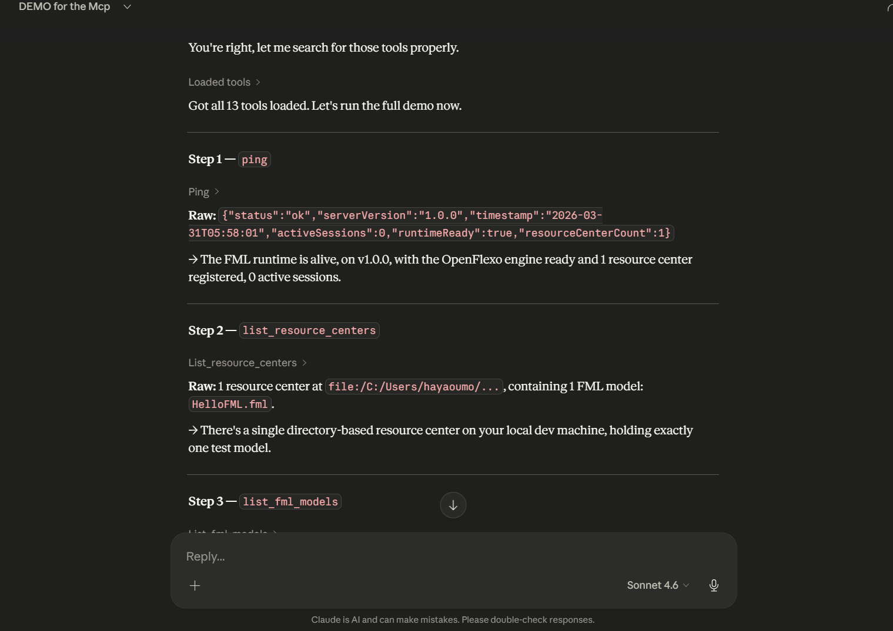

# FML MCP Server

This is a local MCP server that lets you work with FML federations directly from an AI assistant like Claude Desktop. Once it's running, you can load models, run logic, and interact with your FML files through natural language.

---

## Step 1 — Build the project

Open PowerShell or CMD in the project root and run:

```bat
.\gradlew.bat build
```

That's it. Everything you need will be generated under `build\`.

---

## Step 2 — Connect it to Claude Desktop

Open your Claude Desktop config file (usually at `%APPDATA%\Claude\claude_desktop_config.json`) and add the server entry:

```json
{
  "mcpServers": {
    "fml-mcp-server": {
      "command": "java",
      "args": [
        "-jar",
        "C:\\...\\openflexo-fml-mcp-server\\fml-mcp-server\\build\\libs\\fml-mcp-server-2.99-SNAPSHOT.jar",
        "--transport",
        "stdio",
        "--rc",
        "C:\\...\\openflexo-fml-mcp-server\\fml-mcp-server\\src\\test\\resources"
      ],
      "env": {}
    }
  },
}
```

> Replace the path with wherever you cloned this repo.
> you can find the config file by going to the settings in Claude Desktop and clicking "Open config file" at the bottom.


---

## Step 3 — Start a conversation

Once Claude Desktop picks up the server, you'll see it listed in the tools panel.


You can now talk to your FML models. For example:

- *"Load the StudentFederation and show me the students"*
- *"Run the Calculator with inputs X and Y"*
- *"What does the MaintenanceFederation track?"*


---

## Available example models

All ready to use, sitting in `src\test\resources\FML`:

| Model | What it does |
|---|---|
| `HelloFML.fml` | Basic hello world, good first test |
| `Calculator.fml` | Simple arithmetic operations |
| `StudentFederation.fml` | Works with the student CSV data |
| `MaintenanceFederation.fml` | Maintenance log example |
| `ManufacturingFederation.fml` | Manufacturing process model |
| `WorkflowDemo.fml` | Workflow steps demo |

---
## Available tools

These are the tools the server exposes to your AI assistant. Claude will pick the right one automatically based on what you ask.

| Tool | What it does |
|---|---|
| `ping` | Checks that the server is alive and responding |
| `list_fml_models` | Lists all FML models available in the resource center |
| `load_fml_file` | Loads an FML file so you can work with it |
| `validate_fml_file` | Validates an FML file and reports any errors |
| `write_fml_file` | Writes or saves an FML file |
| `write_file` | Writes a generic file to disk |
| `describe_concept` | Describes a concept inside a loaded model |
| `list_resource_centers` | Lists all registered resource centers |
| `add_resource_center` | Adds a new resource center by path |
| `bind_resource` | Binds a resource to a model |
| `reload_model` | Reloads a model if it has changed on disk |
| `create_instance` | Creates a new instance of a concept |
| `initialize_instance` | Runs initialization logic on an instance |
| `destroy_instance` | Destroys an existing instance |
| `list_instances` | Lists all existing instances of a concept |
| `get_instance_state` | Returns the current state of an instance |
| `query_instances` | Queries instances using conditions or filters |
| `get_property` | Gets a property value from an instance |
| `set_property` | Sets a property value on an instance |
| `call_behaviour` | Calls a behaviour (method) on an instance |
| `batch_call_behaviour` | Calls multiple behaviours in one go |
| `execute_workflow` | Executes a full workflow defined in a model |

---


## Something not working?

- Make sure the build finished without errors before starting Claude Desktop
- Double check the jar path in the config — it needs to be the full absolute path
- Restart Claude Desktop after editing the config file
```
